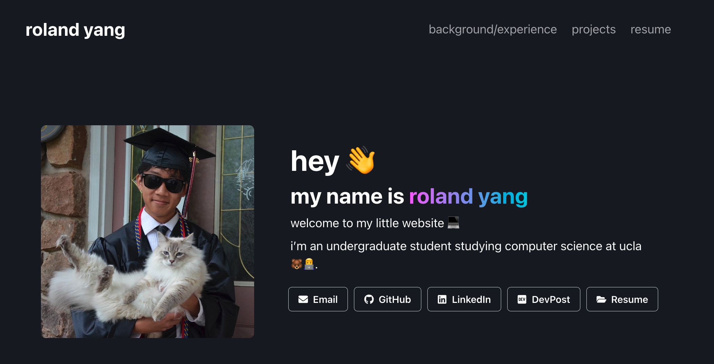

# roland yang website

this is my website 🔥🔥🔥

[rolandyang.dev](https://rolandyang.dev)

i made it using react, gatsby, chakraui as the component library and deployed it on netlify

will update from time to time

if u want to copy it (i don't know why you would) good luck editing it

## why i made it like this

thought having a cool website would help get internship so i tried to make one asap

- react bc react (jk it's quick and organized to make stuff with bc components <3)
- gatsby good for static websites
- chakraui bc it was the component library i was most comfortable with at the time of originally building the website (it's also simple but at the cost of flexibility and customizability looking back)
- netlify because super easy one click and it up